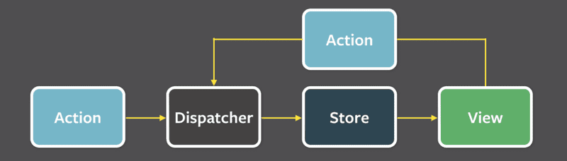

## In Absence of Flux Architecture
Without flux architecture i.e. Redux in React, the state and functions for handling it are placed in a higher level of the component structure of the application. This works fine if the size and reach of application is small but as the application grows this type of architecture for state becomes challenging to manage.  

## Flux Architecture 
 

Flow of data is unidirectional in Flux Architecture: Action -> Dispatcher -> Store -> View  
**Store  :** It is where whole state of the application is saved as *one* JavaScript object.  
**Action :** Action is used to change the state of the store. Actions here are objects, which have at least a field determining the *type* of the action. The impact of the action to the state of the application is defined using a reducer. The reducer is a function that is given the curretn state and an action as parameters. It returns a new state.  


```
const counterReducer = (state, action) => {
  if (action.type === 'INCREMENT') {
    return state + 1
  } else if (action.type === 'DECREMENT') {
    return state - 1
  } else if (action.type === 'ZERO') {
    return 0
  }

  return state
}

```
For further simplifying the code for action, we can use a function creating an action called an action creator:
JavaScript```
const createNote = (content) => {
  return {
    type: 'NEW_NOTE',
    payload: {
      content,
      important: false,
      id: generateId()
    }
  }
}

const toggleImportanceOf = (id) => {
  return {
    type: 'TOGGLE_IMPORTANCE',
    payload: { id }
  }
}
```


